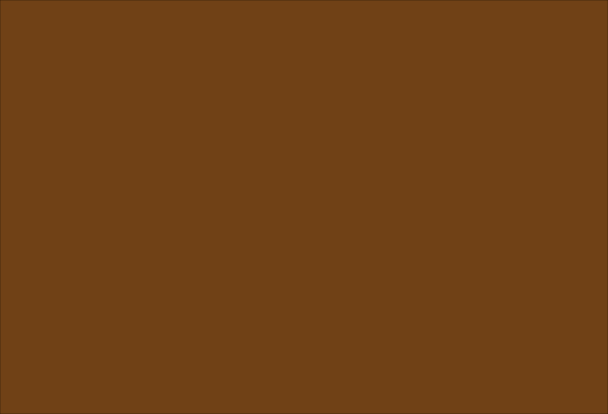
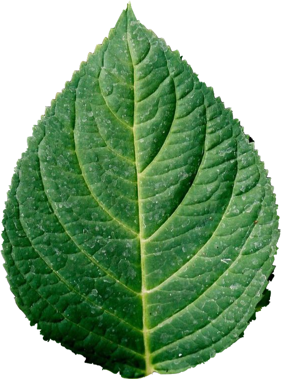
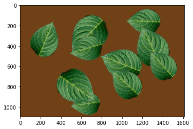

# Garden-Bed-Synthesization

This repo contains scripts helpful for generating synthesized garden bed data for the leaf segmentation task in the AlphaGarden project. It takes in a `json` file containing the following specifications:
- `background`: path to the background image file
- `background_mask`: path to the ground truth mask of the background
- `leaves`: a nested list of 2-element lists containing (path to single occulated leaf image, oridinal leaf type)
- `encodings`: a correspondence between the ordinal leaf types and their mask colors
- `iterations`: number of additional leaves we would like to include in the synthesization process
- `num_copies`: number of images we would like to synthesize
- `dim`: the side length of the square ROI we would like to extract from the background as the frame for synthesis

During the synthesis process, each leaf is applied the following set of augmentations:
- A uniformly random location across the dimensions of the background
- A uniformly random degrees of rotation
- A uniformly random resizing between 0.75x and 1.25x

You can find below a simple example of how 1 plain background and 1 occulated leaf (for 10 iterations):

Here's a randomly synthesized background with the leaves overlayed on top:

